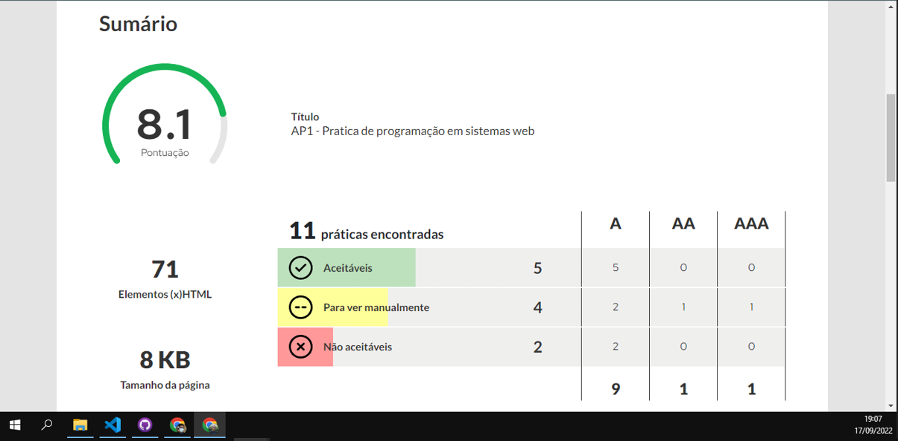

<h1>AP1 – CONSTRUÇÃO DE PÁGINA WEB VÁLIDAS E ACESSÍVEIS</h1>
    <h2>
        PROPOSTA DE TRABALHO
    </h2>
    

        Construir uma página web de tema livre contendo os seguintes elementos HTML:
    

    <ul>
        <li>
            Uma imagem de cabeçalho.
        </li>
        <li>
            Um formulário com no mínimo dois campos e um botão.
        </li>
        <li>
            Duas imagens e dois vídeos, no mínimo.
        </li>
        <li>
            Um título principal e quatro subtítulos, no mínimo.
        </li>
        <li>
            Dois parágrafos, no mínimo, abaixo de cada subtítulo.
        </li>
        <li>
            Um link de âncora interna para acessar cada um dos subtítulos da página.
        </li>
        <li>
            Ao final do último parágrafo da página, deve ter um link para voltar ao topo da página.
        </li>
    </ul>
    

        A página deve estar nos padrões web definidos pelo W3C (World Wide Web Consortium) e para isso deve passar no teste de validação da W3C. Para validar a página, acesse o link: <a href="https://validator.w3.org/.">https://validator.w3.org/.</a> Ao submeter à página ao sistema de validação, o resultado deve ser o seguinte:
    

    
    

        A página deve estar nos padrões aceitáveis de acessibilidade definidos pelo Access Monitor e para isso deve passar no teste de acessibilidade do WCAG 2.1 do W3C. Para validar a página, acesse o link:<a href="https://accessmonitor.acessibilidade.gov.pt/">https://accessmonitor.acessibilidade.gov.pt.</a> Ao submeter à página ao sistema de validação, o resultado deve ser próximo do seguinte:
    

    
    <h2>Resultado das avaliaçoes da pagina entregue</h2>
    
validado:

    
    
Acess Monitor:

    
    URL da página feita: <a href="https://joaoover.github.io/AP1_PPSW/">Githubpages</a>
